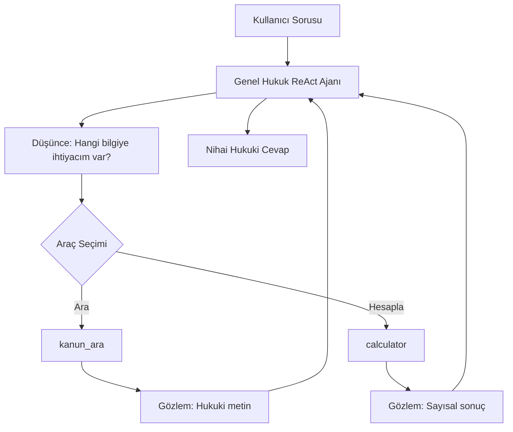

# ⚖️ Genel Hukuk Danışmanı ReAct Ajanı

> **“Kanunları sadece okumaz; yorumlar, hesaplar ve hukuki danışmanlık verir.”**

Bu proje, Türk hukuk sistemine ilişkin soruları yanıtlamak üzere geliştirilmiş,  
**ReAct (Reasoning + Acting)** mimarisine sahip otonom bir **Genel Hukuk Yapay Zeka Asistanı**dır.

Klasik arama motorları veya basit RAG sistemlerinden farklı olarak bu ajan:
- Kanun ve içtihat niteliğindeki metinleri **bağlam içinde yorumlar**
- Hukuki oran ve süreleri **matematiksel hesaplamaya döker**
- İstisnai durumları (şartlar, süreler, hak düşürücü süreler vb.) dikkate alır
- LLM’i yalnızca cevap üretici değil, **hukuki muhakeme yapan bir karar verici** olarak kullanır

---

## 🚀 Proje Özellikleri

### 🧠 ReAct Mimarisi (Reasoning + Acting)
Ajan, karmaşık hukuki problemleri aşağıdaki döngüyle çözer:

**Thought (Düşünce) → Action (Eylem) → Observation (Gözlem) → Final Answer (Cevap)**

Bu sayede ajan:
- Önce **hangi hukuki bilgiye ihtiyaç duyduğunu**
- Ardından **arama mı yoksa hesaplama mı yapacağını**
- Son olarak **sonucu nasıl yorumlayacağını**

kendi kendine planlar.

---

### 🛠️ Araçlar (Tools)

Ajan, hukuki muhakemeyi desteklemek için iki temel araca sahiptir:

| Araç | Açıklama |
|----|----|
| `kanun_ara` | Hukuk verisetleri üzerinde **vektör tabanlı semantik arama** yaparak ilgili hukuki bilgiyi getirir |
| `calculator` | Kıdem tazminatı, fazla mesai, faiz, oran ve süre bazlı **hukuki matematik** işlemlerini yapar |

---

### 📚 Agentic RAG Yaklaşımı
Statik metin getirme yerine ajan:

- Hukuki metni **analiz eder**
- Kullanıcının sorusundaki bağlama göre **yorumlar**
- Gerekirse hesaplama yaparak **kişiselleştirilmiş yanıt** üretir

Örnek:
> “Saatlik ücretim 200 TL ise fazla mesai ne kadar?”  
→ Kanuni oran bulunur (%50)  
→ Hesaplanır  
→ Açıklamalı sonuç sunulur

---

### 🧮 Hukuki Matematik
Ajan, kanun metinlerinde geçen şu ifadeleri sayısal hale getirir:
- “%50 artırımlı”
- “Her yıl için 30 günlük ücret”
- “Yıllık %9 yasal faiz”
- “X ay / Y yıl içinde”

ve bunları **calculator** aracıyla hesaplar.

---

## 📂 Bilgi Tabanı (Knowledge Base)

Bu proje, genel hukuk alanını kapsayan geniş bir veri kümesi kullanır.

### 📌 Kullanılan Veri
- **[HukukV4 Dataset ](https://huggingface.co/akerem1427/Hukukv4)(HuggingFace)**
- Anayasa Hukuku
- Medeni Hukuk
- Ceza Hukuku
- Borçlar Hukuku
- İş Hukuku
- Miras Hukuku

### 📌 İşleme Süreci
- Metinler **semantic embedding** ile vektörleştirilir
- Benzerlik eşiği kullanılarak en alakalı içerik getirilir
- Ajan yalnızca bulduğu bilgiye dayanarak cevap üretir

---

## 🏗️ Çalışma Mantığı (Akış)

🛠️ Kurulum ve Çalıştırma
1️⃣ Gereksinimler

Python 3.8+

Groq API Anahtarı

İnternet bağlantısı (dataset indirimi için)

2️⃣ Kurulum
git clone https://github.com/sinemdurmaz/Agent.git
cd Agent
pip install -r requirements.txt

3️⃣ API Anahtarı Tanımlama
export GROQ_API_KEY="gsk_..."

4️⃣ Çalıştırma
python genel_hukuk.py

🧪 Benchmark & Testler

Ajan; Anayasa, Medeni, Ceza, Borçlar, İş ve Miras Hukuku alanlarından
oluşturulmuş çok kategorili benchmark soruları ile test edilmiştir.

Testler şunları ölçer:

Doğru hukuki kaynağa erişim

Mantıksal muhakeme

Matematiksel doğruluk

Senaryo bazlı yorumlama

⚠️ Hukuki Uyarı

Bu proje eğitim ve araştırma amaçlıdır.
Üretilen cevaplar hukuki danışmanlık niteliği taşımaz.
Nihai kararlar için mutlaka bir hukukçuya danışılmalıdır.

